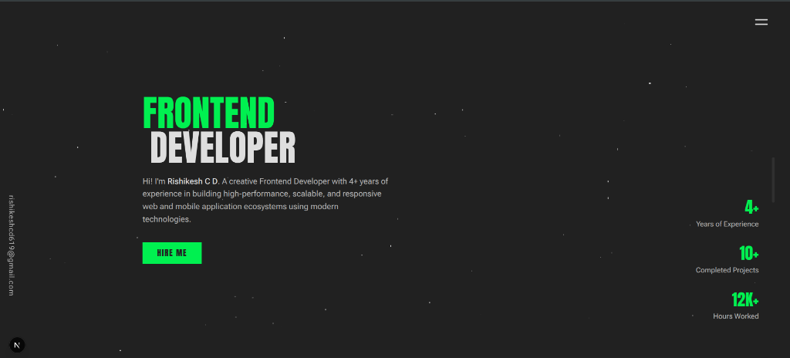

# Rishikesh — Full-Stack Developer Portfolio

A modern portfolio website showcasing my professional experience in web, mobile, and backend development, built with Next.js and TypeScript.

This repository highlights selected projects, technical skills, and engineering practices I use to build scalable, production-ready applications.

## Live Portfolio

[https://rishikeshcd619.github.io/](https://rishikeshcd619.github.io/)

## What This Portfolio Demonstrates

* Real-world full-stack development experience
* Strong fundamentals in frontend architecture
* Scalable backend integration patterns
* Clean, maintainable, and modular code
* Performance-focused and SEO-friendly web applications
* Professional engineering standards and documentation

## Tech Stack

### Core Technologies

* **Next.js** – Server-side rendering, routing, and performance optimization
* **TypeScript** – Type safety and maintainable codebases

### Development Practices

* Component-driven architecture
* Modular and reusable code
* Responsive and accessible UI
* Production-ready project structure

### Deployment

* Vercel / Cloud-ready setup (Deployed on GitHub Pages)

## What You’ll Find in This Repo

* Well-structured Next.js project
* Typed components and utilities
* Clean UI with responsive design
* Scalable folder architecture
* Optimized configuration for modern web apps

## Getting Started (For Reviewers)

```bash
pnpm install
pnpm dev
```

Open: [http://localhost:3000](http://localhost:3000)

## Who This Portfolio Is For

* Recruiters evaluating Full-Stack / Frontend Engineers
* Hiring managers reviewing real project structure
* Teams looking for developers experienced in modern web stacks

## Contributions

Suggestions and improvements are welcome via:

* Issues
* Pull requests

## Forking & Usage Policy

You may fork this repository for learning or inspiration with attribution.

This portfolio reflects personal effort in design, customization, and engineering.
Please do not present this work as your own.

## Credits

* Base template by [Tajmirul](https://tajmirul.site/)
* Custom implementation, projects, and branding by [Rishikesh](https://github.com/rishikeshcd619)
* README inspired by [Brittany Chiang](https://github.com/bchiang7/v4)

## License

MIT License — open source and free to use with attribution.

## Contact

* Email: [rishikeshcd619@gmail.com](mailto:rishikeshcd619@gmail.com)
* LinkedIn: [linkedin.com/in/rishikesh-cd](https://www.linkedin.com/in/rishikesh-cd)
* GitHub: [github.com/rishikeshcd619](https://github.com/rishikeshcd619)

### If you’re a recruiter

Feel free to explore the codebase and reach out — I’m always open to discussing impactful engineering roles.
